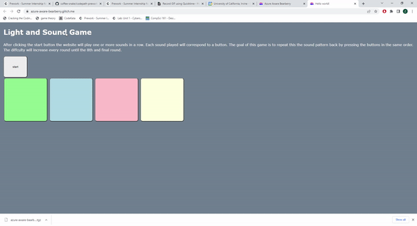

# Pre-work - *Memory Game*

**Memory Game** is a Light & Sound Memory game to apply for CodePath's SITE Program. 

Submitted by: Zhen Wu

Time spent: **2.5** hours spent in total

[Link to project](https://azure-aware-bearberry.glitch.me/): (https://azure-aware-bearberry.glitch.me/)

## Required Functionality

The following **required** functionality is complete:

* [x] Game interface has a heading (h1 tag), a line of body text (p tag), and four buttons that match the demo app
* [x] "Start" button toggles between "Start" and "Stop" when clicked. 
* [x] Game buttons each light up and play a sound when clicked. 
* [x] Computer plays back sequence of clues including sound and visual cue for each button
* [x] Play progresses to the next turn (the user gets the next step in the pattern) after a correct guess. 
* [x] User wins the game after guessing a complete pattern
* [x] User loses the game after an incorrect guess

The following **optional** features are implemented:

* [x] Any HTML page elements (including game buttons) has been styled differently than in the tutorial
* [x] Buttons use a pitch (frequency) other than the ones in the tutorial
* [ ] More than 4 functional game buttons
* [ ] Playback speeds up on each turn
* [x] Computer picks a different pattern each time the game is played
* [ ] Player only loses after 3 mistakes (instead of on the first mistake)
* [ ] Game button appearance change goes beyond color (e.g. add an image)
* [ ] Game button sound is more complex than a single tone (e.g. an audio file, a chord, a sequence of multiple tones)
* [ ] User has a limited amount of time to enter their guess on each turn

The following **additional** features are implemented:

- [ ] List anything else that you can get done to improve the app!

## Video Walkthrough (GIF)

If you recorded multiple GIFs for all the implemented features, you can add them here:

.gif)
.gif)
.gif)

## Reflection Questions
1. If you used any outside resources to help complete your submission (websites, books, people, etc) list them here. 

Used https://developer.mozilla.org/en-US/docs/Web/JavaScript/Reference/Global_Objects/Math/random to find how to generate random number in javascript.

2. What was a challenge you encountered in creating this submission (be specific)? How did you overcome it? (recommended 200 - 400 words) 

I have limited javascript experience so I do not know all of the inbuilt javascript functions. This caused me to have to look up certain javascript functions which slowed down my speed. Another problem I had was the due date. I only learned about the prework 1 week in advance and so did not have much time to complete everything. Usually I like to work on projects for 3 to 4 hours at a time so I can get into the flow zone but due to time constraints I had to split up the work between multiple days. When I came back to the project it took me a bit to remember what I had to work on next. This project also introduced a few new websites that I never used before so I had to learn how to navigate through their interfaces but overall it was pretty easy.

3. What questions about web development do you have after completing your submission? (recommended 100 - 300 words) 

I want to learn more about javascript. I primiary code in python and C++ so I am wondering about the speed of javascript. Would it be worth it to implement some functions on a backend server in c++ or python or is javascript faster because it can directly run in a browswer. Another question I have is how to properly hide the array. Currently if the user does console.log(pattern) then they can see the full randomly generated pattern even though it is supposed to be hidden.

4. If you had a few more hours to work on this project, what would you spend them doing (for example: refactoring certain functions, adding additional features, etc). Be specific. (recommended 100 - 300 words) 

I would make a page for the main menu. This  page would have a play, settings, leaderboard,and rules information button. The play button would be used to launch the game. The settings button could be used to configure how hard the game played. For example it would allow the user to choose if they wanted a random pattern each time, allow them to select the number of possible buttons, upload their own sounds, and if they want to turn on infinite mode. Infinite mode would make the pattern go on forever until they failed. Their score is then saved and put on the leaderboard which can be accesserd through the leaderboard button from the main menu. The game would also now include a button that took you back to the main menu. 

## Interview Recording URL Link

[My 5-minute Interview Recording](https://drive.google.com/file/d/1Q2SoJkR198O4jwzXzwD3sM0rLzc538mS/view)

## License

    Copyright Zhen Wu

    Licensed under the Apache License, Version 2.0 (the "License");
    you may not use this file except in compliance with the License.
    You may obtain a copy of the License at

        http://www.apache.org/licenses/LICENSE-2.0

    Unless required by applicable law or agreed to in writing, software
    distributed under the License is distributed on an "AS IS" BASIS,
    WITHOUT WARRANTIES OR CONDITIONS OF ANY KIND, either express or implied.
    See the License for the specific language governing permissions and
    limitations under the License.